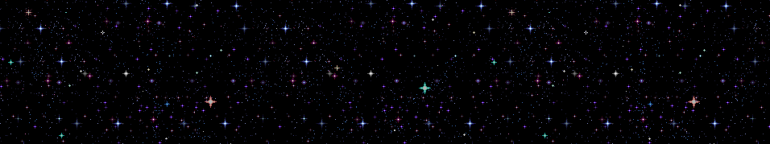

# A Javascript Spaceship Cursor-trail

Everything you need to add an animated sprite-sheet cursor trail, demonstrated with a spaceship.

Designed & tested by myself. You can preview the functionality with my website www.vanh.art.

#### NOTE:
Please be assured this functionality does not require Svelte to function, but is used for a use case
to help with displaying reactivity to page changes and loading.

## What It Does & Why This Exists.

The svelte component is used as a layout applicable cursor which uses various writable to determine the spritesheet x/y 
spritesheet position on mouse movement with a smoothing function.

All you have to do is plug the component into your +layout.svelte, and it follows your cursor. Clicking generates a 
laser image element with a fly-out animation to give a firing effect.

## Why This Exists.

I've often seen with other regular cursors regarding relying on
sole CSS functionality, alternatives I've seen usually rely on a delay and easing causing a jittery result
as CSS is not designed in being able to manage increases or decreases in velocity of the cursor.

I haven't seen a simple implementation of a similar system, and ended up writing this as my own solution;
this is just a project designed to give it out with as little resources required as possible using Svelte as a host.

## How To Use.

Open up the root directory with the command prompt, use `npm install` and `npm run dev`, much like any other project.

## How it works
#### Framerate
On mouse movement, it stores the current time of the animation, and will check on every frame if the time-out
functionality is complete, which is based on the `frameRate` var, this will determine how many times the position is 
stored a second, and is simply to help with optimization and rely more heavily on Svelte's smoothing functionality; the 
resulting generates a "tick", which is simply a means to update the *actual*position of the cursor, the position of 
which is then handled by the aforementioned smoothing.

#### Offset Calculation
Offset calculation is done via calculating the velocity of both the X & Y direction (`x - oldX` & `y- oldY`)
and uses the difference to generate a multiplier value to be used for the sprite-sheet with a range of values
between 0-4, which are then multiplied against the width and the height to get the position on the sprite-sheet.

The actual calculation for this is relatively dumb, and just uses the difference between x and y to determine
the direction the mouse is in (`diffX = Math.abs(x - oldX)`), and then just calculate the speed via. the position 
difference between ticks with a predetermined number (`xRequired1`,`xRequired2`,`yRequired`). 

`xRequired1` and `yRequired` simply check if the difference is enough to be considered movement, hence the `math.abs()`
to make sure that the number is positive to be checked against the pre-determined value properly as a gateway; if
the cursor movement is enough, then we go through the process of determining the next frame we should go to in said
direction. If the cursor goes left, we want the spaceship to lean left, so we add 1 to the multiplier, otherwise we 
remove 1. This multiplier is then thrown into the position look-up made with the width / height and thrown out to the 
image we're using as a cursor trail. Then, do the same math for the Y direction with its own offset.

#### Offsets and how they're used

For the sake of optimization the demo uses 25 different positions, 3 for the Y and 5 for the X values, this can be
changed via `xFrames` and `yFrames` which generates the pre-designed offset arrays for the sprite-sheet, both of these
numbers will require the amount of positions your sprit0sheet can be in on the X and Y axis respectively. 
Aka. (Rows x Cols)

As a result of the y value having an extra 2 sets of frames, we do a second check on the `xDiff` to know which frame
we should use as it's 'tilt', resulting in; `x > oldX ? diffX > xRequired2 ? 4 : 3`, 4 & 3 being the offsets used
to lookup against `offsetCalcX`, with `offsetCalcX` and `offsetCalcY` being the predefined positions we made earlier. 
To figure both of these numbers out, just count the amount of frames on the axis from right to left or up to down on
the sprite-sheet and minus 1; essentially treating this offset multiplier as a coordinate on a grid, and the 
sprite-sheet is the grid. If you wish to add more sets of frames on the animation, add additional checks to figure out 
which frame the animation requires to be on based on the offset required to go there on the grid in each axis.

#### Animation resetting

`coolDown1` and `coolDown2` are the time-outs used after the final tick of mouse movement is processed and how long
it should take until the next step of resetting the animation from the last tick it took. This essentially resets the 
animation back to its default state of `xCentre` or `yCentre`, calculated on initialization.

Each phase checks the xOffset used to generate the sprite-sheet position, and removes or adds one depending on the 
direction; similar to how it was added originally, but this time the opposite way around to reverse the process.
This two part step is required due to the two sets of frames in each direction on the X axis, similar to the checks 
required to determine the multiplier; for each set of frames you have in either direction, requires another set of 
timeouts in order to reset its position back to centre and is a *required* process. 

Each transition step done with the two cool-down variables is recommended to become a larger and larger value with each 
step to create a sine-like transition to smooth out the animation effectively. Without the animation reset step, the 
animation will finish on the final frame the last tick rendered an X/Y position pulled from the mouse. As a result, 
it's generally recommended to keep the amount of rows and columns in each direction as low as possible.

In the demonstration, adding another set of Y frames would add no additional burden to processing the animation, 
as it would require two steps to process regardless alongside the X reset, but would still require the addition of 
the additional processing of reducing the value.

## Notes

Unlike my title-bar-scroller, this functionality isn't as simple to drag across into a basic js/html project, and will
require doing your own research to replace the smoothing function I'm using which is included with svelte; but most
foundations should include a similar function like the one featured in this demo. All that to say, I unfortunately do
not have any pointers on how to begin a project including this without svelte being used.